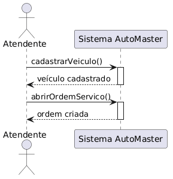
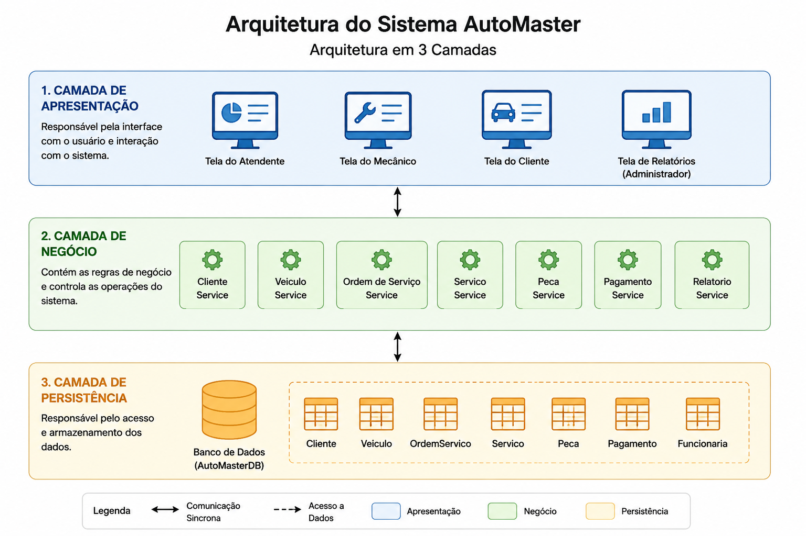
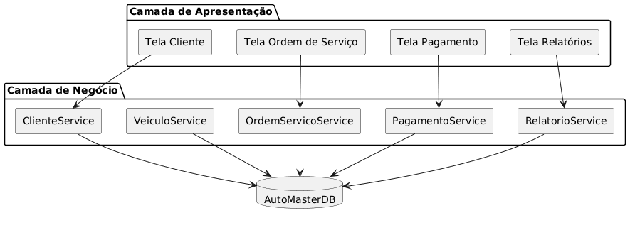
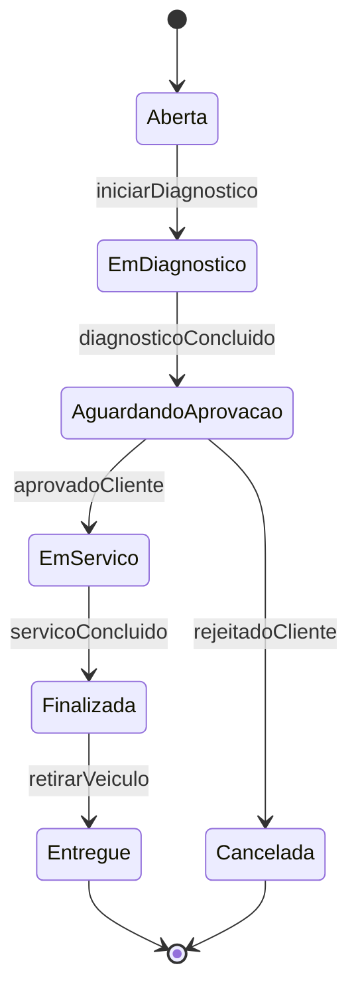
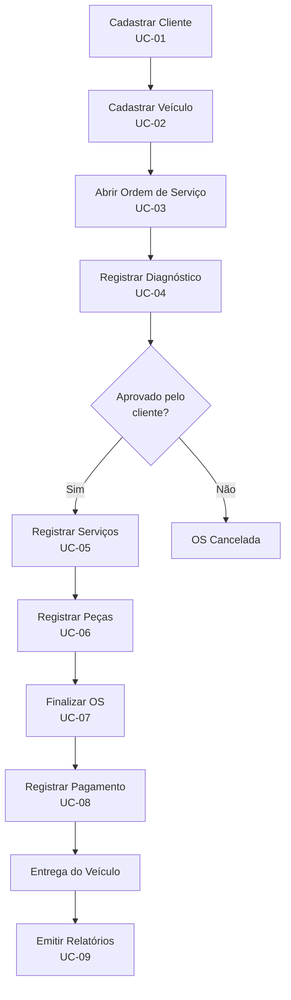

# AutoMaster

> Sistema de gerenciamento para oficinas mecânicas — documentação de projeto de software

[](PDF/Trabalho%20Final-%20Gabriel%20Lacerda.pdf)
[](#)
[](#autor)

---

## Sumário

- [Sobre o Projeto](#sobre-o-projeto)
- [Objetivos](#objetivos)
- [Estrutura do Repositório](#estrutura-do-repositório)
- [Galeria de Diagramas](#galeria-de-diagramas)
- [Atores do Sistema](#atores-do-sistema)
- [Casos de Uso](#casos-de-uso)
- [Diagrama de Casos de Uso](#diagrama-de-casos-de-uso)
- [Contratos de Operação](#contratos-de-operação)
- [Diagramas de Sequência do Sistema](#diagramas-de-sequência-do-sistema)
- [Arquitetura do Sistema](#arquitetura-do-sistema)
- [Diagrama de Componentes](#diagrama-de-componentes)
- [Diagrama de Implantação](#diagrama-de-implantação)
- [Diagrama de Classes](#diagrama-de-classes)
- [Diagramas de Sequência de Projeto](#diagramas-de-sequência-de-projeto)
- [Diagrama de Comunicação](#diagrama-de-comunicação)
- [Diagrama de Estados](#diagrama-de-estados)
- [Modelo de Dados](#modelo-de-dados)
- [Fluxo de Atendimento](#fluxo-de-atendimento)
- [Tecnologias Previstas](#tecnologias-previstas)
- [Documentação Completa](#documentação-completa)
- [Histórico de Revisões](#histórico-de-revisões)
- [Autor](#autor)

---

## Sobre o Projeto

O **AutoMaster** é um sistema projetado para auxiliar o gerenciamento de oficinas mecânicas. A solução permite o controle integrado de:

- Clientes e veículos
- Ordens de serviço (OS)
- Diagnósticos e serviços executados
- Peças e estoque
- Pagamentos
- Funcionários e relatórios gerenciais

O sistema organiza todo o fluxo de atendimento, desde a entrada do veículo na oficina até sua entrega ao cliente após a conclusão dos serviços.

Este repositório contém a **documentação completa do projeto de software**, incluindo modelos de requisitos, arquitetura, diagramas UML e modelo de dados, elaborados como trabalho final da disciplina **Projeto de Software**.

---

## Objetivos

| Objetivo | Descrição |
|----------|-----------|
| **Organizar o atendimento** | Centralizar o fluxo desde o cadastro do cliente até a entrega do veículo |
| **Controlar ordens de serviço** | Rastrear status, diagnósticos, serviços e peças utilizadas |
| **Gerenciar financeiro** | Registrar pagamentos e calcular valores totais das OS |
| **Apoiar a gestão** | Fornecer relatórios para o administrador da oficina |
| **Separar responsabilidades** | Definir papéis claros para atendentes, mecânicos e administradores |

---

## Estrutura do Repositório

```
trabalho-final-automaster/
│
├── Diagramas/
│   ├── Arquitetura.png              # Arquitetura em 3 camadas
│   ├── Caso de Uso 1.0.png          # Diagrama de casos de uso
│   ├── Componentes.png              # Diagrama de componentes
│   ├── Diagrama Classe 1.0.png      # Diagrama de classes
│   ├── Diagrama Comunicacao.png     # Diagrama de comunicação
│   ├── Diagrama Estado.png          # Máquina de estados da OS
│   ├── Diagrama Implantação.png     # Diagrama de implantação
│   ├── Diagrama Sequencia.png       # Sequência de projeto (abrir OS)
│   ├── Entidade Relacionamento.png  # Modelo entidade-relacionamento
│   ├── Finalizar servico.png        # Sequência UC-07
│   ├── Registrar diagnostico.png    # Sequência UC-04
│   └── Servico.png                  # Sequência UC-03
│
├── PDF/
│   └── Trabalho Final- Gabriel Lacerda.pdf   # Documento oficial do projeto
│
└── README.md                        # Este arquivo
```

---

## Galeria de Diagramas

Todas as imagens do projeto estão na pasta [`Diagramas/`](Diagramas/). Clique em qualquer diagrama para abrir o arquivo original.

### Requisitos

| Diagrama | Arquivo |
|----------|---------|
| Casos de Uso | [`Caso de Uso 1.0.png`](Diagramas/Caso%20de%20Uso%201.0.png) |

<p align="center">
  <a href="Diagramas/Caso%20de%20Uso%201.0.png">
    
  </a>
</p>

### Sequência do Sistema

| UC | Diagrama | Arquivo |
|----|----------|---------|
| UC-03 | Abrir Ordem de Serviço | [`Servico.png`](Diagramas/Servico.png) |
| UC-04 | Registrar Diagnóstico | [`Registrar diagnostico.png`](Diagramas/Registrar%20diagnostico.png) |
| UC-07 | Finalizar Ordem de Serviço | [`Finalizar servico.png`](Diagramas/Finalizar%20servico.png) |

<p align="center">
  <a href="Diagramas/Servico.png">
    
  </a>
  <br><em>UC-03 — Abrir Ordem de Serviço</em>
</p>

<p align="center">
  <a href="Diagramas/Registrar%20diagnostico.png">
    
  </a>
  <br><em>UC-04 — Registrar Diagnóstico</em>
</p>

<p align="center">
  <a href="Diagramas/Finalizar%20servico.png">
    
  </a>
  <br><em>UC-07 — Finalizar Ordem de Serviço</em>
</p>

### Arquitetura e Componentes

| Diagrama | Arquivo |
|----------|---------|
| Arquitetura em 3 Camadas | [`Arquitetura.png`](Diagramas/Arquitetura.png) |
| Componentes | [`Componentes.png`](Diagramas/Componentes.png) |
| Implantação | [`Diagrama Implantação.png`](Diagramas/Diagrama%20Implanta%C3%A7%C3%A3o.png) |

<p align="center">
  <a href="Diagramas/Arquitetura.png">
    
  </a>
  <br><em>Arquitetura em 3 Camadas</em>
</p>

<p align="center">
  <a href="Diagramas/Componentes.png">
    
  </a>
  <br><em>Diagrama de Componentes</em>
</p>

<p align="center">
  <a href="Diagramas/Diagrama%20Implanta%C3%A7%C3%A3o.png">
    
  </a>
  <br><em>Diagrama de Implantação</em>
</p>

### Projeto e Comportamento

| Diagrama | Arquivo |
|----------|---------|
| Classes | [`Diagrama Classe 1.0.png`](Diagramas/Diagrama%20Classe%201.0.png) |
| Sequência (Projeto) | [`Diagrama Sequencia.png`](Diagramas/Diagrama%20Sequencia.png) |
| Comunicação | [`Diagrama Comunicacao.png`](Diagramas/Diagrama%20Comunicacao.png) |
| Estados da OS | [`Diagrama Estado.png`](Diagramas/Diagrama%20Estado.png) |

<p align="center">
  <a href="Diagramas/Diagrama%20Classe%201.0.png">
    
  </a>
  <br><em>Diagrama de Classes</em>
</p>

<p align="center">
  <a href="Diagramas/Diagrama%20Sequencia.png">
    
  </a>
  <br><em>Diagrama de Sequência — Abrir Ordem de Serviço</em>
</p>

<p align="center">
  <a href="Diagramas/Diagrama%20Comunicacao.png">
    
  </a>
  <br><em>Diagrama de Comunicação</em>
</p>

<p align="center">
  <a href="Diagramas/Diagrama%20Estado.png">
    
  </a>
  <br><em>Diagrama de Estados da Ordem de Serviço</em>
</p>

### Modelo de Dados

| Diagrama | Arquivo |
|----------|---------|
| Entidade-Relacionamento | [`Entidade Relacionamento.png`](Diagramas/Entidade%20Relacionamento.png) |

<p align="center">
  <a href="Diagramas/Entidade%20Relacionamento.png">
    
  </a>
  <br><em>Diagrama Entidade-Relacionamento</em>
</p>

---

## Atores do Sistema

O AutoMaster possui quatro atores principais, cada um com responsabilidades distintas no fluxo da oficina:

### Cliente

Pessoa que solicita serviços para seu veículo. Pode iniciar o processo de abertura de ordem de serviço junto ao atendente.

### Atendente

Responsável pelas operações de recepção e financeiro:

- Cadastro de clientes e veículos
- Abertura de ordens de serviço
- Registro de pagamentos

### Mecânico

Responsável pelas operações técnicas da oficina:

- Registro de diagnósticos
- Registro de serviços executados
- Registro de peças utilizadas
- Finalização de ordens de serviço

### Administrador

Responsável pela gestão estratégica do sistema:

- Emissão de relatórios gerenciais
- Acompanhamento de indicadores da oficina

---

## Casos de Uso

| ID | Caso de Uso | Ator | Descrição |
|----|-------------|------|-----------|
| **UC-01** | Cadastrar Cliente | Atendente | Registra um novo cliente no sistema com nome, telefone e e-mail |
| **UC-02** | Cadastrar Veículo | Atendente | Associa um veículo (placa, modelo, marca, ano) a um cliente |
| **UC-03** | Abrir Ordem de Serviço | Atendente / Cliente | Cria uma nova OS para um veículo cadastrado |
| **UC-04** | Registrar Diagnóstico | Mecânico | Registra o diagnóstico técnico de uma OS existente |
| **UC-05** | Registrar Serviços Executados | Mecânico | Adiciona os serviços realizados na ordem de serviço |
| **UC-06** | Registrar Peças Utilizadas | Mecânico | Registra as peças consumidas e atualiza o estoque |
| **UC-07** | Finalizar Ordem de Serviço | Mecânico | Encerra a OS após conclusão dos serviços |
| **UC-08** | Registrar Pagamento | Atendente | Registra o pagamento do cliente referente à OS |
| **UC-09** | Emitir Relatórios | Administrador | Gera relatórios gerenciais do sistema |

---

## Diagrama de Casos de Uso

O diagrama abaixo apresenta a visão geral das funcionalidades do sistema e a relação entre atores e casos de uso.

<p align="center">
  <a href="Diagramas/Caso%20de%20Uso%201.0.png">
    
  </a>
</p>

**Relações principais:**

- O **Cliente** e o **Atendente** podem abrir ordens de serviço
- O **Atendente** gerencia cadastros e pagamentos
- O **Mecânico** executa diagnósticos, serviços, peças e finalização
- O **Administrador** acessa relatórios

---

## Contratos de Operação

Os contratos de operação definem as pré e pós-condições das operações críticas do sistema.

### `abrirOrdemServico()` — UC-03

| Campo | Valor |
|-------|-------|
| **Referência cruzada** | UC-03 — Abrir Ordem de Serviço |
| **Pré-condições** | Cliente cadastrado e veículo cadastrado |
| **Pós-condições** | Ordem de serviço criada com status **Aberta** |

### `registrarDiagnostico()` — UC-04

| Campo | Valor |
|-------|-------|
| **Referência cruzada** | UC-04 — Registrar Diagnóstico |
| **Pré-condições** | Ordem de serviço existente |
| **Pós-condições** | Diagnóstico registrado na ordem de serviço |

### `finalizarOrdemServico()` — UC-07

| Campo | Valor |
|-------|-------|
| **Referência cruzada** | UC-07 — Finalizar Ordem de Serviço |
| **Pré-condições** | Serviços e peças registrados |
| **Pós-condições** | Ordem de serviço finalizada |

---

## Diagramas de Sequência do Sistema

Diagramas de sequência em nível de sistema, mostrando a interação entre atores e o sistema AutoMaster.

### UC-03 — Abrir Ordem de Serviço

Fluxo em que o atendente cadastra o veículo e, em seguida, abre a ordem de serviço.

<p align="center">
  <a href="Diagramas/Servico.png">
    
  </a>
</p>

**Fluxo:**

1. Atendente solicita `cadastrarVeiculo()` → Sistema retorna `veículo cadastrado`
2. Atendente solicita `abrirOrdemServico()` → Sistema retorna `ordem criada`

### UC-04 — Registrar Diagnóstico

Fluxo em que o mecânico registra o diagnóstico de uma ordem de serviço.

<p align="center">
  <a href="Diagramas/Registrar%20diagnostico.png">
    
  </a>
</p>

**Fluxo:**

1. Mecânico envia `registrarDiagnostico(descricao)` → Sistema retorna `diagnóstico registrado`

### UC-07 — Finalizar Ordem de Serviço

Fluxo em que o mecânico finaliza a ordem de serviço após a execução dos serviços.

<p align="center">
  <a href="Diagramas/Finalizar%20servico.png">
    
  </a>
</p>

**Fluxo:**

1. Mecânico envia `finalizarOrdemServico()` → Sistema retorna `ordem finalizada`

---

## Arquitetura do Sistema

O AutoMaster adota uma **arquitetura em três camadas**, garantindo separação de responsabilidades, manutenibilidade e escalabilidade.

<p align="center">
  <a href="Diagramas/Arquitetura.png">
    
  </a>
</p>

### Camada de Apresentação

Responsável pela interface com o usuário e interação com o sistema.

| Tela | Público | Função |
|------|---------|--------|
| Tela do Atendente | Atendente | Cadastros, abertura de OS e pagamentos |
| Tela do Mecânico | Mecânico | Diagnósticos, serviços e peças |
| Tela do Cliente | Cliente | Consulta e acompanhamento |
| Tela de Relatórios | Administrador | Relatórios gerenciais |

### Camada de Negócio

Contém as regras de negócio e controla as operações do sistema.

| Serviço | Responsabilidade |
|---------|------------------|
| `ClienteService` | Gestão de clientes |
| `VeiculoService` | Gestão de veículos |
| `OrdemServicoService` | Ciclo de vida das ordens de serviço |
| `ServicoService` | Registro de serviços executados |
| `PecaService` | Gestão de peças e estoque |
| `PagamentoService` | Processamento de pagamentos |
| `RelatorioService` | Geração de relatórios |

### Camada de Persistência

Responsável pelo acesso e armazenamento dos dados no banco **AutoMasterDB**.

**Tabelas principais:** Cliente, Veículo, OrdemServico, Serviço, Peça, Pagamento, Funcionário.

### Legenda de Comunicação

| Símbolo | Significado |
|---------|-------------|
| Seta dupla sólida | Comunicação síncrona entre camadas |
| Seta tracejada | Acesso a dados |
| Azul | Camada de Apresentação |
| Verde | Camada de Negócio |
| Amarelo | Camada de Persistência |

---

## Diagrama de Componentes

O diagrama de componentes detalha a relação entre as telas da camada de apresentação, os serviços da camada de negócio e o banco de dados.

<p align="center">
  <a href="Diagramas/Componentes.png">
    
  </a>
</p>

**Mapeamento Tela → Serviço:**

| Tela | Serviço |
|------|---------|
| Tela Cliente | `ClienteService` |
| Tela Ordem de Serviço | `OrdemServicoService` |
| Tela Pagamento | `PagamentoService` |
| Tela Relatórios | `RelatorioService` |

Todos os serviços da camada de negócio (`ClienteService`, `VeiculoService`, `OrdemServicoService`, `PagamentoService`, `RelatorioService`) possuem acesso direto ao **AutoMasterDB**.

---

## Diagrama de Implantação

O diagrama de implantação descreve a infraestrutura física/lógica onde o sistema será executado.

<p align="center">
  <a href="Diagramas/Diagrama%20Implanta%C3%A7%C3%A3o.png">
    
  </a>
</p>

### Nós de Implantação

| Nó | Componente | Descrição |
|----|------------|-----------|
| **Computador do Atendente** | Navegador Web | Interface de acesso ao sistema pelo usuário |
| **Servidor AutoMaster** | Sistema AutoMaster | Aplicação com lógica de negócio e APIs |
| **PostgreSQL** | Banco de Dados | Armazenamento persistente dos dados |

**Fluxo de comunicação:**

```
Navegador Web  →  Sistema AutoMaster  →  PostgreSQL
```

---

## Diagrama de Classes

O diagrama de classes modela a estrutura estática do sistema, incluindo entidades, atributos, métodos e relacionamentos.

<p align="center">
  <a href="Diagramas/Diagrama%20Classe%201.0.png">
    
  </a>
</p>

### Entidades Principais

#### Cliente

| Atributo | Tipo |
|----------|------|
| `id` | int |
| `nome` | String |
| `telefone` | String |
| `email` | String |

**Métodos:** `cadastrar()`, `atualizar()`, `consultar()`

#### Veículo

| Atributo | Tipo |
|----------|------|
| `id` | int |
| `placa` | String |
| `modelo` | String |
| `marca` | String |
| `ano` | int |

**Métodos:** `cadastrar()`, `atualizar()`

#### OrdemServico

| Atributo | Tipo |
|----------|------|
| `id` | int |
| `dataAbertura` | Date |
| `status` | String |
| `valorTotal` | double |

**Métodos:** `abrir()`, `adicionarServico()`, `adicionarPeca()`, `calcularValorTotal()`, `finalizar()`

#### Diagnóstico

| Atributo | Tipo |
|----------|------|
| `id` | int |
| `descricao` | String |
| `data` | Date |

**Métodos:** `registrar()`

#### Serviço

| Atributo | Tipo |
|----------|------|
| `id` | int |
| `descricao` | String |
| `valor` | double |

**Métodos:** `registrar()`

#### Peça

| Atributo | Tipo |
|----------|------|
| `id` | int |
| `nome` | String |
| `preco` | double |
| `estoque` | int |

**Métodos:** `atualizarEstoque()`

#### Pagamento

| Atributo | Tipo |
|----------|------|
| `id` | int |
| `valor` | double |
| `formaPagamento` | String |
| `data` | Date |

**Métodos:** `registrarPagamento()`

### Hierarquia de Funcionários

```
Funcionario (base)
├── Mecanico      → registrarDiagnostico(), executarServico()
├── Atendente     → abrirOrdemServico(), registrarPagamento()
└── Administrador → emitirRelatorio()
```

### Relacionamentos

| Relação | Multiplicidade |
|---------|----------------|
| Cliente → Veículo | 1 : 0..* |
| Veículo → OrdemServico | 1 : 0..* |
| OrdemServico → Diagnóstico | 1 : 1 |
| OrdemServico → Serviço | 1 : * |
| OrdemServico → Peça | 1 : * |
| OrdemServico → Pagamento | 1 : 1 |

---

## Diagramas de Sequência de Projeto

Diagrama de sequência em nível de projeto, detalhando a interação entre camadas ao abrir uma ordem de serviço.

<p align="center">
  <a href="Diagramas/Diagrama%20Sequencia.png">
    
  </a>
</p>

**Participantes:** Atendente → Tela Ordem de Serviço → OrdemServicoController → OrdemServico → Banco de Dados

**Sequência de mensagens:**

| # | Origem | Destino | Mensagem |
|---|--------|---------|----------|
| 1 | Atendente | Tela Ordem de Serviço | `solicitarAberturaOS()` |
| 2 | Tela Ordem de Serviço | OrdemServicoController | `abrirOrdemServico(dados)` |
| 3 | OrdemServicoController | OrdemServico | `criar()` |
| 4 | OrdemServico | OrdemServicoController | `ordemCriada` |
| 5 | OrdemServicoController | Banco de Dados | `salvar(OS)` |
| 6 | Banco de Dados | OrdemServicoController | `confirmação` |
| 7 | OrdemServicoController | Tela Ordem de Serviço | `ordem criada` |
| 8 | Tela Ordem de Serviço | Atendente | `exibirSucesso()` |

---

## Diagrama de Comunicação

O diagrama de comunicação apresenta a mesma operação de abertura de OS, enfatizando a colaboração entre objetos e a numeração das mensagens.

<p align="center">
  <a href="Diagramas/Diagrama%20Comunicacao.png">
    
  </a>
</p>

**Fluxo numerado:**

```
1.   Atendente        → TelaOS       : abrirOS()
1.1  TelaOS           → Controller   : abrirOS()
1.2  Controller       → Banco        : salvarOS()
1.3  Banco            → Controller   : confirmação
1.4  Controller       → TelaOS       : sucesso
1.5  TelaOS           → Atendente    : ordem criada
```

---

## Diagrama de Estados

A ordem de serviço segue um ciclo de vida bem definido, representado pelo diagrama de estados abaixo.

<p align="center">
  <a href="Diagramas/Diagrama%20Estado.png">
    
  </a>
</p>

### Estados e Transições

| Estado | Descrição | Transição de Saída | Evento |
|--------|-----------|-------------------|--------|
| **Aberta** | OS recém-criada | → EmDiagnostico | `iniciarDiagnostico` |
| **EmDiagnostico** | Diagnóstico em andamento | → AguardandoAprovacao | `diagnosticoConcluido` |
| **AguardandoAprovacao** | Aguardando decisão do cliente | → EmServico | `aprovadoCliente` |
| **AguardandoAprovacao** | Aguardando decisão do cliente | → Cancelada | `rejeitadoCliente` |
| **EmServico** | Serviços sendo executados | → Finalizada | `servicoConcluido` |
| **Finalizada** | Serviços concluídos | → Entregue | `retirarVeiculo` |
| **Entregue** | Veículo entregue ao cliente | → [fim] | — |
| **Cancelada** | OS cancelada pelo cliente | → [fim] | — |

### Representação em Mermaid



---

## Modelo de Dados

### Diagrama Entidade-Relacionamento

<p align="center">
  <a href="Diagramas/Entidade%20Relacionamento.png">
    
  </a>
</p>

O modelo relacional contempla **9 entidades**, incluindo tabelas de junção para relacionamentos N:N.

### Esquema das Tabelas

#### Tabela `Cliente`

| Campo | Tipo | Restrição |
|-------|------|-----------|
| `id_cliente` | INTEGER | **PK** |
| `nome` | VARCHAR(100) | — |
| `telefone` | VARCHAR(20) | — |
| `email` | VARCHAR(100) | — |

#### Tabela `Veiculo`

| Campo | Tipo | Restrição |
|-------|------|-----------|
| `id_veiculo` | INTEGER | **PK** |
| `placa` | VARCHAR(10) | — |
| `modelo` | VARCHAR(50) | — |
| `marca` | VARCHAR(50) | — |
| `ano` | INTEGER | — |
| `id_cliente` | INTEGER | **FK** → Cliente |

#### Tabela `OrdemServico`

| Campo | Tipo | Restrição |
|-------|------|-----------|
| `id_os` | INTEGER | **PK** |
| `data_abertura` | DATE | — |
| `status` | VARCHAR(30) | — |
| `valor_total` | DECIMAL(10,2) | — |
| `id_veiculo` | INTEGER | **FK** → Veículo |

#### Tabela `Diagnostico`

| Campo | Tipo | Restrição |
|-------|------|-----------|
| `id_diagnostico` | INTEGER | **PK** |
| `descricao` | TEXT | — |
| `data` | DATE | — |
| `id_os` | INTEGER | **FK** → OrdemServico |

#### Tabela `Servico`

| Campo | Tipo | Restrição |
|-------|------|-----------|
| `id_servico` | INTEGER | **PK** |
| `descricao` | VARCHAR | — |
| `valor` | DECIMAL | — |

#### Tabela `Peca`

| Campo | Tipo | Restrição |
|-------|------|-----------|
| `id_peca` | INTEGER | **PK** |
| `nome` | VARCHAR(100) | — |
| `preco` | DECIMAL(10,2) | — |
| `estoque` | INTEGER | — |

#### Tabela `Pagamento`

| Campo | Tipo | Restrição |
|-------|------|-----------|
| `id_pagamento` | INTEGER | **PK** |
| `valor` | DECIMAL(10,2) | — |
| `forma_pagamento` | VARCHAR(30) | — |
| `data` | DATE | — |
| `id_os` | INTEGER | **FK** → OrdemServico |

#### Tabela `OrdemServicoServico` (junção N:N)

| Campo | Tipo | Restrição |
|-------|------|-----------|
| `id_os` | INTEGER | **FK** → OrdemServico |
| `id_servico` | INTEGER | **FK** → Servico |

#### Tabela `OrdemServicoPeca` (junção N:N)

| Campo | Tipo | Restrição |
|-------|------|-----------|
| `id_os` | INTEGER | **FK** → OrdemServico |
| `id_peca` | INTEGER | **FK** → Peca |
| `quantidade` | INTEGER | — |

### Relacionamentos do Banco

| Relação | Cardinalidade |
|---------|---------------|
| Cliente → Veículo | 1 : N |
| Veículo → OrdemServico | 1 : N |
| OrdemServico → Diagnóstico | 1 : N |
| OrdemServico → Pagamento | 1 : N |
| OrdemServico ↔ Serviço | N : N (via OrdemServicoServico) |
| OrdemServico ↔ Peça | N : N (via OrdemServicoPeca) |

---

## Fluxo de Atendimento

Visão integrada do ciclo completo de uma ordem de serviço no AutoMaster:



### Passo a passo

1. **Recepção** — O atendente cadastra o cliente (UC-01) e o veículo (UC-02)
2. **Abertura** — Uma ordem de serviço é criada com status "Aberta" (UC-03)
3. **Diagnóstico** — O mecânico analisa o veículo e registra o diagnóstico (UC-04)
4. **Aprovação** — O cliente aprova ou rejeita o orçamento/diagnóstico
5. **Execução** — Serviços (UC-05) e peças (UC-06) são registrados
6. **Finalização** — O mecânico encerra a OS (UC-07)
7. **Pagamento** — O atendente registra o pagamento (UC-08)
8. **Entrega** — O veículo é entregue ao cliente
9. **Gestão** — O administrador consulta relatórios (UC-09)

---

## Tecnologias Previstas

Com base nos diagramas de arquitetura e implantação, a stack tecnológica prevista para implementação é:

| Camada | Tecnologia |
|--------|------------|
| **Frontend** | Navegador Web (interface responsiva) |
| **Backend** | Sistema AutoMaster (API com camada de serviços) |
| **Banco de Dados** | PostgreSQL |
| **Arquitetura** | 3 camadas (Apresentação, Negócio, Persistência) |
| **Padrão de Projeto** | MVC (Model-View-Controller) |

---

## Documentação Completa

O documento oficial do projeto, com todos os diagramas e especificações detalhadas, está disponível em:

📄 **[Trabalho Final — Gabriel Lacerda.pdf](PDF/Trabalho%20Final-%20Gabriel%20Lacerda.pdf)**

**Informações do documento:**

| Campo | Valor |
|-------|-------|
| Título | Documentação de Projeto para o sistema AutoMaster |
| Versão | 1.0 |
| Data | 7 de junho de 2026 |
| Disciplina | Projeto de Software |

---

## Histórico de Revisões

| Nome | Data | Motivo da Alteração | Versão |
|------|------|---------------------|--------|
| Gabriel Lacerda | 8 de junho de 2026 | Criação inicial do documento | 1.0 |

---

## Autor

**Gabriel Lacerda Lemos da Silva**

Trabalho elaborado como parte da disciplina **Projeto de Software**.

---

<p align="center">
  <strong>AutoMaster</strong> — Gestão inteligente para oficinas mecânicas
  <br>
  <em>Documentação de Projeto v1.0</em>
</p>
